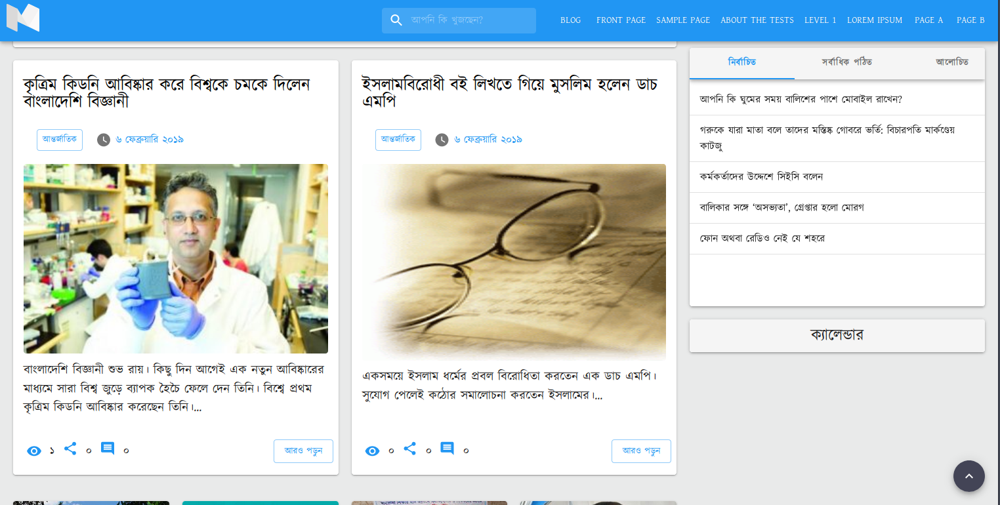

# Material News Portal WordPress Theme

Material News Portal is a modern and feature-rich WordPress theme specifically designed for news portals and media websites. Built using React and Material UI, it offers a seamless single-page application experience, ensuring fast and efficient navigation for your users. The theme was initially created in 2018 and supported WordPress version 4. With this open-source release, I aim to update the theme to support the current major WordPress version 6.

## Features

- **Modern Design**: Material News Portal provides a clean and contemporary design that emphasizes content, enabling your news articles to take center stage.

- **Single Page Application (SPA)**: The theme leverages React to create a SPA, resulting in a smooth and responsive user experience.

- **Material UI**: Built on the Material UI framework, Material News Portal offers a cohesive and visually appealing user interface, with consistent styling across components.

- **WordPress REST API**: Utilizing the WordPress REST API, the theme efficiently fetches and updates data, ensuring real-time content updates without page reloads.

## License

Material News Portal is licensed under the [GNU General Public License v3.0](https://www.gnu.org/licenses/gpl-3.0.en.html) or later. See the [LICENSE](LICENSE) file for more details..

## Contact

If you have any questions or need further assistance, feel free to contact the project maintainer at [hm.ibrahimalkhalil@gmail.com](mailto:hm.ibrahimalkhalil@gmail.com).